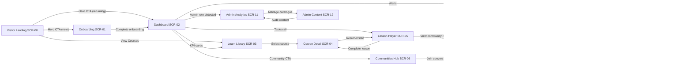

# Screen Logic Flow Map – Version 1.00

- Swimlane ownership documented in FigJam board `Web v1.00 / Flow Swimlanes`.
- Decision conditions (auth state, role, completion) encoded as guard clauses in routing layer (`apps/web/src/routes`).
- Reduced-motion preference bypasses transitions between nodes, using crossfade only.
